# User Guide

This guide walks you through the core workflow of using OpenClip to process and manage video clips.

The pictures are taken from the standard project — *First Project*, the short
demo that ships with the repository — so what you see here is what you get on a
fresh install before uploading anything of your own. They are generated by
`frontend/scripts/docs-screenshots.mjs` against a running stack; re-run it after
a change to the interface so the guide and the application do not drift apart.

## 1. Getting Started: Projects Page
When you launch the application, you arrive at the **Projects Page**. This is your dashboard for all video processing tasks.

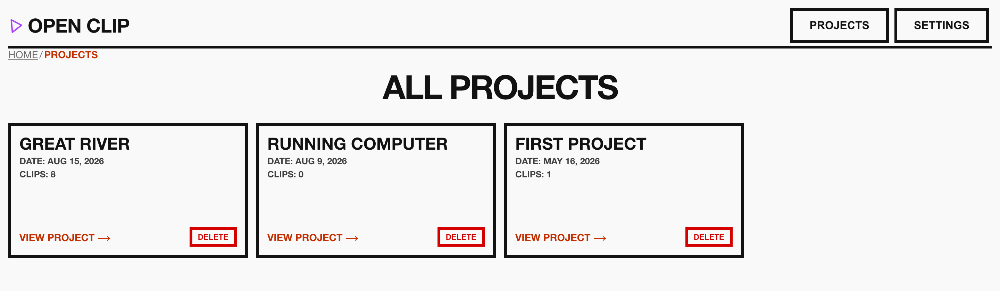

From here, you can view existing projects or create a new one.

## 2. Uploading a Video
To start a new project, click the upload button to navigate to the **Upload Screen**.

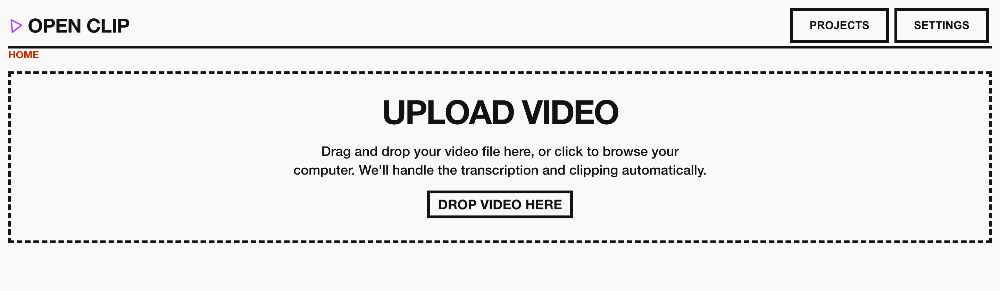

1. Select your video file.
2. Provide necessary project details.
3. Upon submission, the project is created, and you are automatically navigated to the **Project Details** page.

## 3. Running the Pipeline and Managing Details
In the **Project Details** view, the project is initialized but not yet processed. The page itself is the clip grid — one card per highlight — and everything else about the project hangs off the bar at the top: **Pipeline**, **Project settings**, **Writing** and **Export**.

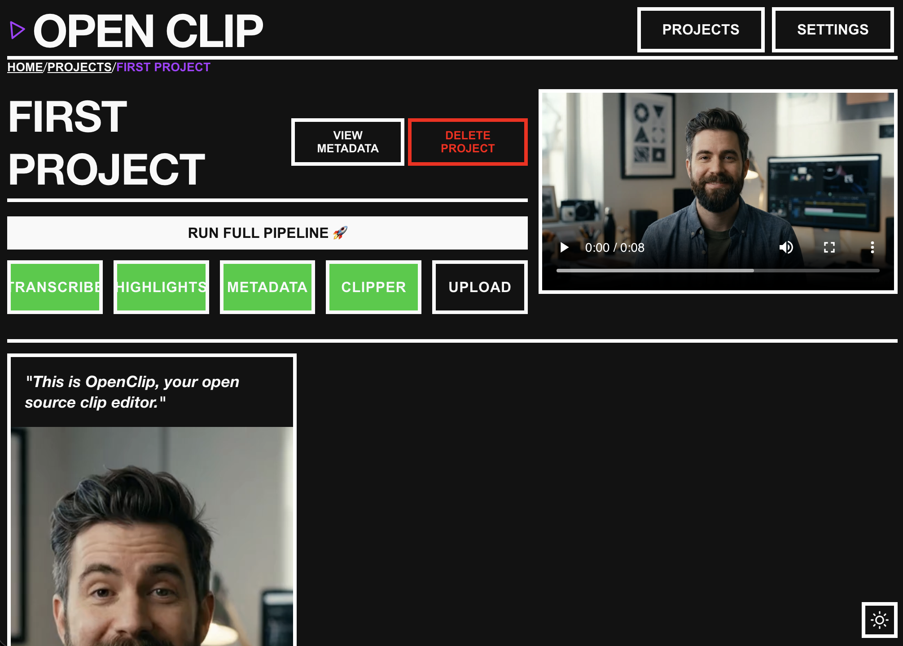

**Pipeline** opens the steps and what each one has done. **Run full pipeline** does the lot; a single step runs on its own, and a step that has already finished says so.

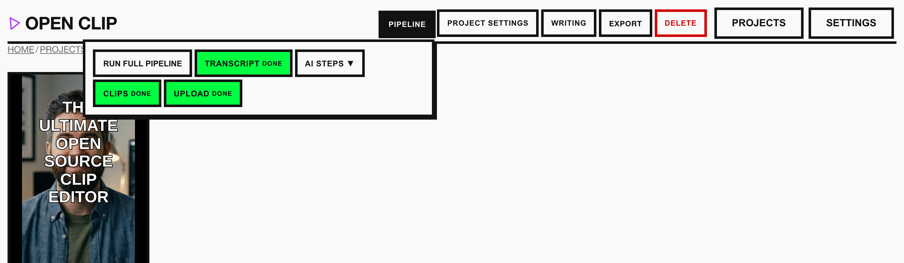

**Project settings** holds the aspect ratio, the resolution, what the cards show while they are paused, and the way into this project's **Captions** and **Description**.

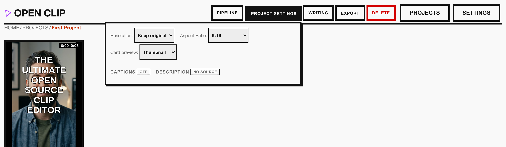

1. **Trigger Processing**: Click the action to start the pipeline. The interface is reactive and will update in real-time as the backend processes the video.
2. **Review Output**: Once complete, you can view the transcription, manage generated clips, and perform clip-specific actions.
3. **Publish one clip**: **Upload to YouTube** on a clip's detail page publishes that clip on its own, with the title and description described below. The clip is cut again first, from its settings as they stand — so the Clips step is not something to run beforehand, and what goes up is what the page was showing rather than a file cut before the last change to its captions or title. That makes it an encode followed by an upload: the button reports that it is running and keeps going if you leave the page, and the published link appears on the clip when it lands. A clip that is already live says so instead of offering an untouched button, and uploading a second time adds another video rather than replacing the first.
4. **Work from the grid**: every action on a clip's detail page is also on its card in the grid — upload, re-render, captions, overlay text and thumbnail — so a pass over a dozen clips does not mean opening a dozen pages. The card guards publishing the same way the detail page does, and a card whose clip is already live links to the video and to its Studio page.

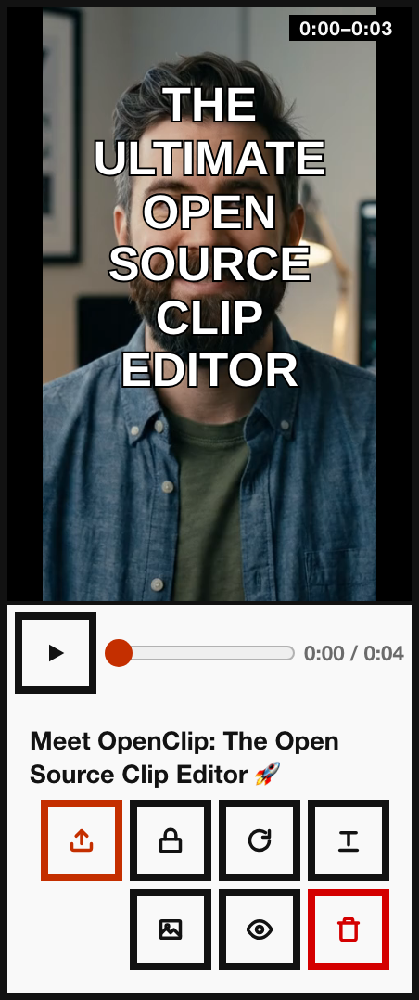

The row of buttons on the card, in order: upload to YouTube, caption settings for this clip, re-render, overlay text, thumbnail, open the clip's page, delete.

Opening a clip gives it the whole window: the player with its title and captions drawn over it, the transcript, what the model wrote for each platform, the exact description an upload would carry, and the actions.

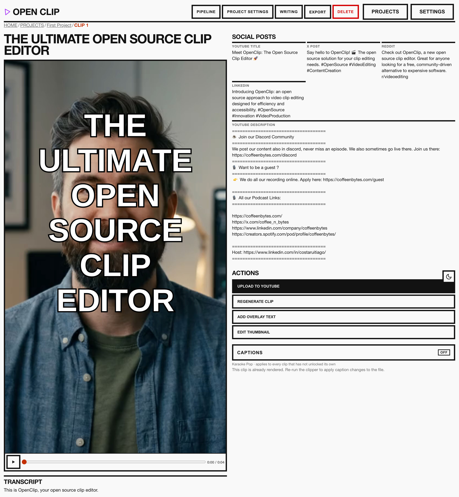

## 4. Captions and Animated Subtitles
The **Captions** panel opens from **Project settings → Captions** on the project page, and from **Captions** under Actions on any clip's detail page. Captions are a project setting either way — the renderer burns the same style into every clip — so setting them from the project page decides it before anything is cut.

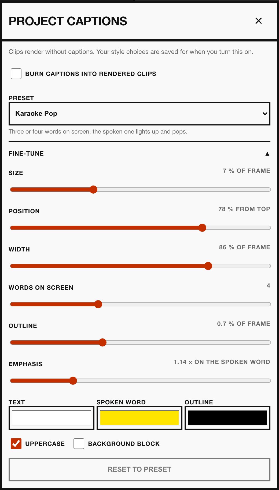

1. **Pick a preset**: *Karaoke Pop* (a few words on screen, the spoken one lights up and pops), *Word Punch* (one oversized word at a time), *Boxed Bold* (karaoke on a solid block), or *Clean Lines* (plain, unanimated subtitle blocks).
2. **Adjust it**: size, position on the frame, width, how many words share the screen, outline thickness, emphasis on the spoken word, and the text, spoken-word and outline colours. Sliders are sized as percentages of the frame, so the same settings hold at any output resolution.
3. **Watch the preview**: play the clip and the captions animate over it, word by word. This is drawn from the same cues and style the renderer uses, so it is what the burned clip will look like, not an approximation.
4. **Render**: with **Burn captions into rendered clips** ticked, running the **Clips** step burns them into each clip. An `.ass` subtitle file is written next to every clip either way, so the captions can also be dropped straight into an editor.

Captions come from the word-level timings the **Transcript** step already produces, so there is no extra transcription pass and no cost to changing the style.

Caption settings belong to the project. The **Settings Page** only sets where a *new* project starts; restyling one project never touches another. Changing the style of a clip that is already rendered needs the **Clips** step re-run to reach the file.

One clip can break away from the project's style with the padlock button on its card. The dialog that opens plays the clip itself with the captions drawn over it, so placement — whether the words clear a face, a lower third, or the platform's own controls — is judged against the footage they will land on rather than against a slider labelled "% from top". **Use custom settings** copies the project's current values onto the clip as a starting point, so unlocking changes nothing by itself; **Follow the project again** discards the clip's copy. A clip whose cut file already has captions burned in is previewed from the source instead, because drawing over burned words would show two sets at once.

> Burning captions in needs an ffmpeg built with libass. The Docker image has one. A local ffmpeg without it still cuts clips and still writes the `.ass` files, but the pixels come out uncaptioned — check with `ffmpeg -filters | grep subtitles`.

## 5. Overlay Titles
A clip can carry a title: one piece of text drawn over the picture at the start of the clip and faded out a few seconds later. It has two halves — *how* a title is drawn, which is one decision for the whole project, and *what* it says, which is never the same on two clips.

**Overlay titles** in the project's options bar is the first half: font, size, placement, colours, outline, shadow and timing, and nothing about any particular line. It is what every title in the project is drawn in — including the automatic ones on the thumbnails, whose words the model wrote — so restyling here restyles every still at once. **Burn titles into rendered clips** at the top of it decides whether titles reach the video as well; it starts switched off, so a project you never touch burns nothing.

The words are the second half, and they belong to the clip. **Add overlay text** on a clip's card or detail page writes one; the dialog opens on the project's look, so writing a title never means restyling one. **Remove this title** at the foot of that dialog takes it back off, leaving the thumbnail to fall back on the model's line. To give one clip no title against a project that burns them, write its own and untick **Burn this title into rendered clips**.

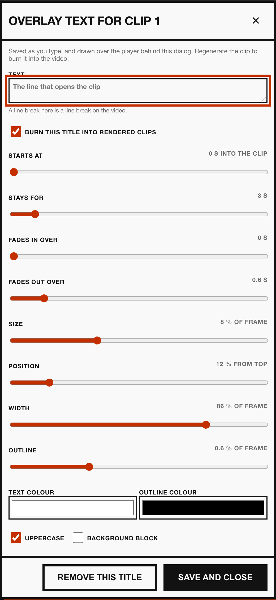

This title is also the text on the clip's thumbnail, which is the thing a viewer actually clicks. That is what the defaults are set for: three to five words, ultra-bold, heavy outline, hard shadow, one word in a second colour.

1. **Write it**: the text is saved as you type, and drawn over the player behind the dialog as you go. A line break in the box is a line break on the video. Wrap one word in asterisks — `we *lost* everything` — and it is drawn in the marked-word colour, which is what gives the eye somewhere to land. The counter under the box says how many words you are at; past five it says so, because a thumbnail read as a paragraph is not read.
2. **Time it**: the title starts at the top of the clip by default and stays for three seconds. **Starts at**, **Stays for** and **Fades out over** move all of that; playing the clip shows the real timing, including the fade.
3. **Style it**: start from **Look** — *Outlined*, *Yellow on black* or *Black on white* — which sets the colours, the outline and the shadow as one group. Yellow on black is the pairing that measures highest on a thumbnail; black on white is the one for dark footage. Everything is then adjustable on its own: size, position from the top of the frame, width, outline, shadow, the four colours, uppercase and a background block. The shadow is a hard offset behind the words, on by default — it is what lifts a title off the picture, and unlike a fade it is still there in the single frame a thumbnail is made of. Like the caption sliders these are percentages of the frame, so they hold at any output resolution. If a word is too wide for the frame at the size you have chosen, the dialog says so: the burn cuts a word off rather than breaking it, so the fix is a smaller size, a wider title, or a line break.
4. **Check it at feed size**: **Feed size (120px)** under the preview shrinks the whole frame to the width a phone feed gives a thumbnail. It is the only test that matters — if the words do not land at that size, nobody scrolling reads them. The same button is on the thumbnail editor.
5. **Burn it in**: the title is drawn over the preview immediately, but it only reaches the file when the clip is cut. Use **Regenerate clip** on the same page.

Changing the project's overlay configuration reaches every still immediately, the same way a caption restyle reaches every preview — and, the same way, it only reaches a rendered clip when that clip is cut again. A clip that has written its own title keeps the look it was given; restyle it in its own dialog.

### Regenerating a single clip
**Regenerate clip** re-cuts the one clip you are looking at with whatever its settings now say — its title, its captions, and the project's aspect ratio and resolution. Every other rendered clip is left alone, which is the difference between this and re-running the **Clips** step, and it is also how a clip that has never been cut gets rendered on its own.

The encode runs on the backend and keeps going if you leave the page. The button reports when it finishes, and says so plainly if the render stopped without producing a file.

## 6. Thumbnails
Every clip has a thumbnail without being asked for one: the first frame of the clip, with the clip's title drawn on it and no subtitles. If that is the thumbnail you want, there is nothing to do.

No picture file is made in advance. A thumbnail is a frame of the clip with text over it, and the app draws both — so what you see on the clip page and on every card *is* the thumbnail, live, updating the moment you change it. The image itself is rendered once, at upload, and attached to the video.

The title on it is worked out rather than typed, in this order:

1. **The clip's own overlay text**, if you wrote one. A line you typed is never overridden, and editing it changes the thumbnail too.
2. **The thumbnail line the model wrote** for this clip — a handful of words with one of them wrapped in asterisks, which is drawn in the marked-word colour. The Highlights step writes it for the still specifically: it is read at feed size, with no sound and no context, which is a different sentence from the hook. You can see it on the clip page under **Thumbnail text**.
3. **The hook**, then the YouTube title, for clips found before this existed.

A thumbnail with no words on it is the one outcome worth avoiding, which is why the chain runs that far.

Whichever line wins, it is drawn in the project's overlay configuration — see **Overlay titles** above. That is what makes a project's stills look like one project without anybody typing a title on any of them.

**Edit thumbnail** on the clip's detail page changes the two decisions a machine cannot make:

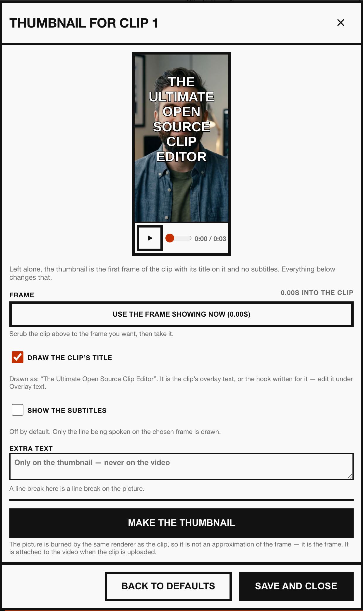

1. **Which frame**: scrub the player at the top of the dialog to the frame you want and press **Use the frame showing now**. A frame past the end of the clip is pulled back inside it, because the source keeps going where the clip does not.
2. **What is written on it**: the clip's title can be switched off, the subtitles can be switched on — only the line being spoken on the chosen frame is drawn — and **Extra text** adds a second line that appears on the picture and never on the video. It gets its own size, position and width, in percentages of the frame like every other text control here.

**Back to defaults** returns the clip to the first frame with its title on it. **Make the thumbnail** is there when you want the file itself — to download it, or to check it against the preview. It is burned by the renderer that cuts the clips, at the project's aspect ratio and with the fonts the burn uses, so it is the frame rather than an impression of it. You never have to press it: uploading renders the picture from the same settings.

A clip that is sitting still shows its thumbnail rather than whichever frame the player happens to be parked on — on the clip's own page and on every card in the grid. It opens on the frame the thumbnail is taken from, so the still is not one moment wearing another moment's title. Pressing play, or scrubbing anywhere, hands the picture back to the video. **Still clips show** in the project's options bar switches the whole project between **Thumbnail** and **Video frame**, which is the one to pick while cutting rather than reviewing. The caption, overlay and thumbnail dialogs always show the footage: their previews exist to show a paused frame.

> A custom thumbnail is attached after the upload, through a separate YouTube call, and a channel without a verified phone number cannot have custom thumbnails at all. If YouTube refuses it, the clip is still published — the picture is what is missing, and it can be set by hand in Studio.

> The file sent is the one in the project's `thumbnails/` folder — the picture you made and can look at. Change it after the clip has gone up and **Upload thumbnail to YouTube**, on the clip's page under Actions, puts the new one on the video that is already there: same video, same id, same views, only the still changes. It is also how a clip published by an older version gets its picture.

> YouTube goes on processing a video after the upload itself has finished, and finishing that processing writes YouTube's own generated thumbnail over anything set in the meantime. So the picture is attached twice: once straight away, and again once YouTube says it is done, which is the one that stays. Asking whether it is done needs the **youtube.readonly** permission — **Settings → YouTube Channel** says when the connected channel is short of it, and **Reconnect Channel** grants it. Without it the second attempt is made on a timer instead, and may land too early.

## 7. YouTube Descriptions
Every clip is uploaded with a description assembled from four sources: what the model wrote about that clip, the original video this project was cut from, text belonging to this project, and text you keep on every project.

The **Description** panel, at **Project settings → Description** on the project page, holds the project's share of it:

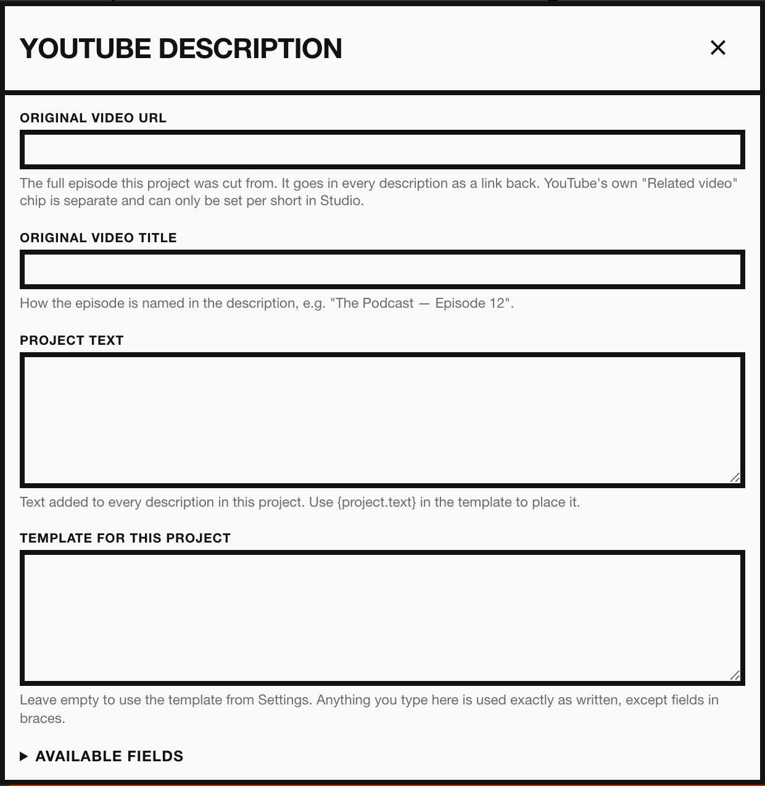

1. **Original video URL**: the full episode the shorts came from. Putting this link in a short's description is how YouTube connects the short back to the video it was cut from, so fill it in before uploading anything.
2. **Original video title**: how the episode is named in prose — the default description reads *"This is a short from the original podcast &lt;title&gt;."*
3. **Project text**: a call to action, links or credits that belong to this project alone.
4. **Template for this project**: overrides the application-wide template, for this project only.

The template is plain text. Anything you type is used exactly as written; a field in braces is replaced with its value. Writing `{highlights.ai_video_description}` gives the description the model wrote for that clip, and writing `this is a text` gives `this is a text`. The **Available fields** list under each template box names every field, `{project.source_url}` and `{global.text}` among them.

A line whose fields are all empty is left out, so a project with no original video URL simply has no link line rather than a dangling label.

**Settings Page → YouTube Descriptions** holds the two application-wide pieces: the text placed wherever the template says `{global.text}`, and the default template every project uses until it overrides it. Unlike the caption defaults, these are read at upload time — editing them changes what every existing project publishes.

Each clip's detail page shows the finished description under **YouTube description**. It is rendered by the same builder the uploader uses, so it is the exact text that gets published.

## 8. Posting Everywhere Else: Postiz
YouTube is the one platform this app publishes to itself. Everything else goes through [Postiz](https://postiz.com) — the open-source scheduler you either self-host or use in the cloud — which already owns the calendar, the per-platform settings and the previews.

**Import to Postiz**, on a clip's detail page under Actions, cuts the clip afresh, sends the video to Postiz and writes the post for every channel you have chosen. It is the same job the YouTube upload is: it re-renders first, so what arrives is the clip as the page shows it, it reports that it is running, and it keeps going if you leave the page.

What it makes is a **draft**. Nothing reaches an audience: the clip is sitting on your own calendar, written and attached, waiting for you to read it and press send. That is why the button has no confirmation in front of it and why importing twice is safe — it makes a second draft rather than doing anything you cannot undo. When it lands, the clip says **Waiting in Postiz** with a link to the calendar.

Opening the project asks Postiz what has happened since, so a clip does not go on claiming to be waiting after you have sent it. A clip that went out says **Published from Postiz** and links to the post on the platform itself rather than to the calendar; one still due says **Scheduled in Postiz**; one that failed to send says so. It is worth reading before importing again — a second import of something already live is a duplicate post, not a correction.

There is one thing Postiz will not tell anybody, and it shapes the rest: its API returns no drafts at all. So a post that has not been sent looks exactly like a post that was deleted, and neither this app nor the page will guess between them — an unsent clip keeps saying **Waiting in Postiz**, and nothing is ever cleared on the strength of Postiz's silence. That is the opposite of the YouTube check, where a video that has gone does clear the record, because there the silence is an answer.

Each channel says what the model wrote for its platform: the X post goes to X, the LinkedIn post to LinkedIn, the Reddit post to Reddit. A channel the model writes nothing specific for — a Facebook page, a Mastodon account — gets the clip's full description, rendered through the same template the YouTube upload uses.

**Postiz** in Settings holds three things:

1. **Postiz API Key**: in Postiz under **Settings → Public API**. Nothing else on the panel is asked until this is saved.
2. **Postiz URL**: your own instance, as you open it in a browser. Leave it empty for Postiz cloud.
3. **Channels**: read from Postiz once the key works, so you tick accounts rather than typing ids. Nothing is ticked for you, and ticking none means nothing is imported — clips only go where you said they should.

Some platforms need something only you can supply: a Discord channel id, a subreddit, a Pinterest board. Postiz refuses a post without it and says which field it wanted, and that sentence lands on the clip. **Extra settings for a channel**, under the channel list, is where the answer goes — `channel=123456789012345678` for a Discord, one `field=value` per channel. Which fields a platform wants is Postiz's business, so this app does not keep a list of them; it passes yours through and repeats what Postiz says about the rest.

One Postiz account serves every project on the machine, and the projects are not one thing — a company's podcast and a side project are cut on the same install and must not land in the same accounts. So Settings is the default and a project may disagree: **Postiz** in the project's settings menu, beside Description, holds this project's own channels and its own choice of draft, scheduled or sent.

A project follows Settings until you tick something there; from that moment it keeps its own list, and changing the default no longer moves it. **Follow Settings again** puts it back. Ticking nothing in a project that has its own list means that project imports nowhere — which is a choice, and different from never having made one.

All the channels for one clip travel in a single post, so a channel Postiz refuses would take the others with it. It does not: the refused ones are dropped, the rest are filed, and the clip says which were left out and why.

The video is uploaded once. It goes to Postiz before the post is created, so a post that fails — a channel missing a setting, a rate limit — would otherwise leave the file uploaded and send it again on the next attempt. Instead the clip remembers what Postiz stored, and reuses it for as long as the video is the same one. Re-cut the clip into something different and it is sent again; press **Import to Postiz** twice on an unchanged clip and it is not.

**What an import makes** is the same panel's one consequential setting. It is *a draft, for you to send* by default. *A scheduled post* files it against a time an hour out, and *Posted immediately* sends it — which, unlike everything else here, does reach an audience.

Clips do not queue up waiting for each other. Once Postiz is configured, each clip is filed the moment the clipper finishes cutting it — so the first draft is on the calendar while the last clip is still encoding, rather than an hour later. **Import each clip as soon as it is cut** in Settings turns that off, leaving the filing to the step below.

There is also a **Postiz Drafts** step in the pipeline, next to Clips and Upload. It does the same thing to every clip in the project in one run, skipping any clip already filed since its last cut — so running it after a Clips run does not put a second identical draft on the calendar. It checks the key, the URL and the channels before it cuts anything, so a project with Postiz unconfigured fails in the first second and says so under the pipeline row rather than sitting on **running**.

## 9. Configuring Settings
You can customize the application's behavior in the **Settings Page**.

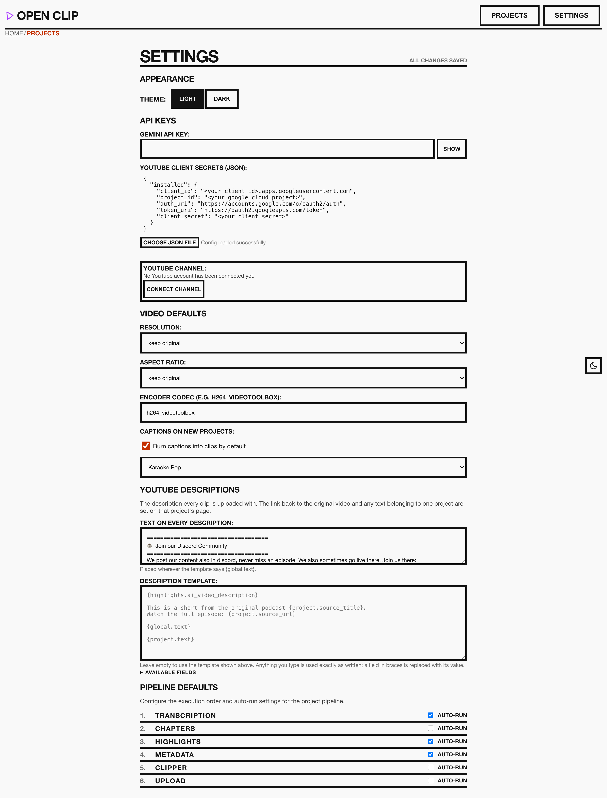

Adjust your configuration (API keys, models, etc.). Changes made here are written to one of three files under `backend/config/`, picked by what the setting is:

| File | Holds | In git |
| --- | --- | --- |
| `settings.json` | Application settings: theme, model, codec, log level, pipeline and caption defaults. | Yes |
| `user_settings.json` | Your own content: the default description, the Postiz post and comment templates, and the Postiz server URL. | No |
| `secrets.json` | Credentials and account identifiers: the Gemini API key, the YouTube client secrets, the Postiz API key and channel IDs. | No |

The split exists so the repository can be shared without carrying your descriptions, your self-hosted URLs or your keys. Both ignored files are created on first run and are mounted into the container, so they survive a rebuild.

### Connecting a YouTube channel
Publishing needs two separate things. **YouTube Client Secrets (JSON)** is the OAuth client for your own Google Cloud project — which application is asking. **YouTube Channel → Connect Channel** is the channel's consent — who it may act for. The button opens Google in a new tab; when you finish there, the panel says the channel is connected and the token is written to `backend/youtube_credentials/`.

Nothing about that tab is binding. Close it, pick the wrong account, or walk away: press the button again and another window opens. Attempts do not queue or block each other — whichever one you finish is the one that counts, and any you abandon expire after five minutes. **Cancel** clears them without opening another.

The panel also names any permission the stored connection is short of. That happens to a channel connected before a permission was added to the app: uploads carry on working, and **Reconnect Channel** grants the rest without touching anything else.
